 

<table border="0">
  <tr>
    <td width="50%" valign="top">
      
    </td>
    <td width="50%" valign="top">
      
    </td>
  </tr>
</table>

  

    <strong>Github Metrics</strong>
  

  

     
    
  

